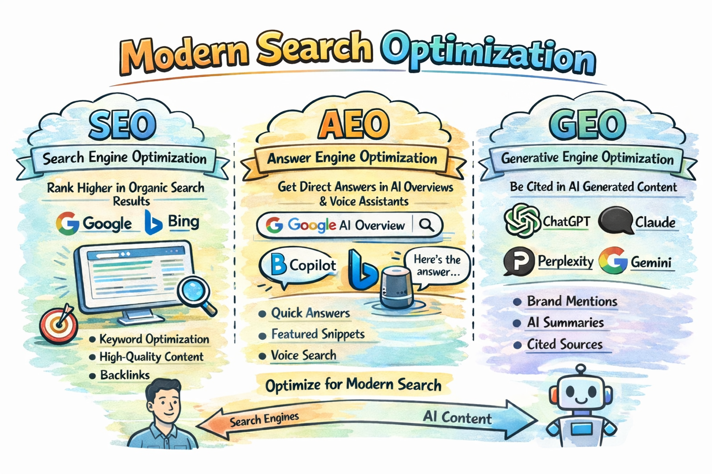
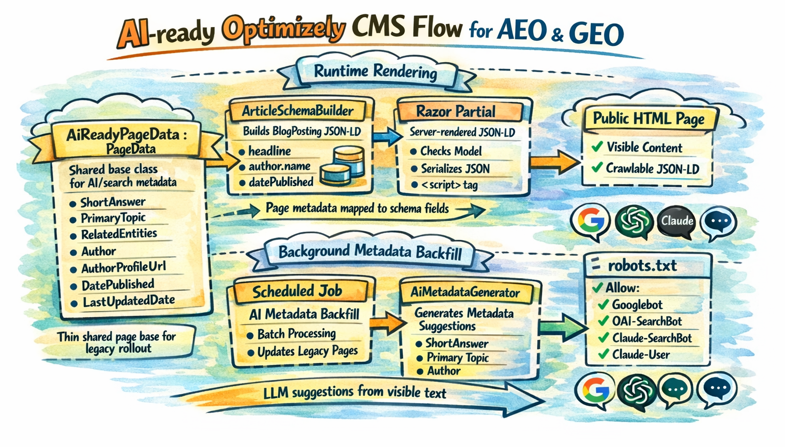

SEO is still the base layer, but it is no longer enough on its own. Traditional SEO helps search engines find and rank pages. AEO and GEO help AI systems understand those pages, summarize them, and decide whether they are worth citing. In practice, the website is no longer built only for people and Google crawlers. It also becomes a source of truth for AI agents.

Before going further, the terms are worth making explicit:

- **AEO** stands for **Answer Engine Optimization**. The goal is to make a page easy for answer engines and assistants to lift as a direct answer. Think Google AI Overviews, Bing Copilot, or voice assistants.
- **GEO** stands for **Generative Engine Optimization**. The goal is to make your brand and content easy to mention, summarize, and cite inside generated AI responses such as ChatGPT, Claude, Perplexity, or Gemini.



The short version is this: **AEO helps your page become the answer, while GEO helps your brand become the cited source behind the answer.**

| Area | Traditional SEO | AEO / GEO |
| --- | --- | --- |
| Main goal | Rank in search results | Be selected and cited in AI answers |
| Main channel | Google, Bing, classic SERPs | ChatGPT, Claude, Perplexity, Gemini, AI Overviews |
| Core tactics | Keywords, backlinks, technical SEO | Structure, metadata, schema, direct answers |
| Main metric | Rankings, clicks, traffic | Mentions, citations, qualified visits |
| Typical path | Search -> click -> website | Question -> AI answer -> validation visit |

The important part is simple: AEO and GEO do not replace SEO. They extend it. If your SEO is weak, AI may not find your content. If your content is messy, generic, or outdated, AI may still find it and ignore it.

## Why the real problem is usually legacy architecture

AEO and GEO discussions often start with metadata: short answers, authors, dates, topics, and entities. That is useful, but in a real Optimizely CMS project the first question is usually more practical: **how do we improve machine readability without rebuilding the whole content model?** On a legacy site with many page types, many blocks, and a large volume of existing content, that is usually the real challenge.

The good news is that **Optimizely CMS already supports an incremental approach**. Content types are defined in code, public properties become CMS properties, and **Scheduled Jobs** are a native way to enrich older content over time. At the same time, **Google's guidance is a useful reality check**: for AI Overviews and AI Mode, there are no extra AI-only technical requirements beyond normal Search eligibility. That is the core idea behind this article: **do not rebuild everything**. Add a **small shared metadata layer**, keep the implementation practical, and use a **Scheduled Job** to backfill legacy content gradually.

## The case: a legacy CMS with many page types and block types

Imagine a typical mature Optimizely solution:

- around 10 page types
- around 10 block types
- years of existing content
- different editorial patterns
- a business goal to improve visibility in Google, ChatGPT, and Claude

In this article, I want to show how to approach that problem from a practical implementation perspective in a legacy Optimizely CMS codebase. The goal is not to describe a perfect content architecture from scratch, but to show a pattern that is realistic to introduce in existing code: a small shared metadata layer, server-rendered structured data, crawler-aware decisions, and a Scheduled Job that helps enrich older content over time.

## The practical solution

A good legacy-friendly pattern looks like this:

- put a small set of shared AI and search properties on a common page base class
- generate machine-readable output from those fields in server-rendered Razor
- use a restartable, stoppable Scheduled Job to backfill missing values in batches

The implementation also needs to stay aligned with what the three vendors actually document:

- **Google** is mostly about classic Search fundamentals: the page must be crawlable, indexable, eligible for snippets, and the structured data must match the visible content on the page.
- **OpenAI** is more explicit about crawler access than about schema details. In practice, the key question is whether your public content can be reached by `OAI-SearchBot` for summaries and snippets, while `GPTBot` remains a separate control for training-related access.
- **Anthropic** documents separate bot roles for search discovery, user-driven retrieval, and model crawling. That means `Claude-SearchBot`, `Claude-User`, and `ClaudeBot` should be treated as distinct controls in `robots.txt`, depending on what kind of access you want to allow.

That gives you a model that is small enough for legacy CMS work, but rich enough to support better search and answer-engine visibility.



## Recommended Optimizely implementation

The implementation below is intentionally practical. It is designed for a legacy site where you want high impact with low structural disruption.

### 1. Add a thin shared base class for pages

This is the best first step because Optimizely officially supports the shared-base-class pattern for page types.

```csharp
using System;
using System.ComponentModel.DataAnnotations;
using EPiServer.Core;
using EPiServer.DataAbstraction;

namespace MySite.Features.AeoGeo
{
    // Shared metadata for most informational pages.
    public abstract class AiReadyPageData : PageData
    {
        [CultureSpecific]
        [Display(Name = "Short answer", GroupName = SystemTabNames.Content, Order = 100)]
        public virtual string ShortAnswer { get; set; }

        [CultureSpecific]
        [Display(Name = "Primary topic", GroupName = SystemTabNames.Content, Order = 200)]
        public virtual string PrimaryTopic { get; set; }

        [CultureSpecific]
        [Display(Name = "Related entities", GroupName = SystemTabNames.Content, Order = 300)]
        public virtual string RelatedEntities { get; set; }

        [CultureSpecific]
        [Display(Name = "Author", GroupName = SystemTabNames.Content, Order = 400)]
        public virtual string Author { get; set; }

        [CultureSpecific]
        [Display(Name = "Author profile URL", GroupName = SystemTabNames.Content, Order = 500)]
        public virtual string AuthorProfileUrl { get; set; }

        [Display(Name = "Published date", GroupName = SystemTabNames.Content, Order = 600)]
        public virtual DateTime? PublishedDate { get; set; }

        [Display(Name = "Last updated date", GroupName = SystemTabNames.Content, Order = 700)]
        public virtual DateTime? LastUpdatedDate { get; set; }
    }
}
```

Why add `AuthorProfileUrl`? Because Google explicitly recommends `author.url` as a way to identify the author more clearly in article markup.

### 2. Build the schema object in a dedicated service

This keeps the Razor partial clean and makes the implementation easier to test.

```csharp
using System;

namespace MySite.Features.AeoGeo
{
    public interface IArticleSchemaBuilder
    {
        object Build(AiReadyPageData page, string absoluteUrl);
    }

    public class ArticleSchemaBuilder : IArticleSchemaBuilder
    {
        public object Build(AiReadyPageData page, string absoluteUrl)
        {
            return new
            {
                @context = "https://schema.org",
                @type = "BlogPosting",
                headline = page.Name,
                description = page.ShortAnswer,
                url = absoluteUrl,
                mainEntityOfPage = new { @type = "WebPage", @id = absoluteUrl },
                author = string.IsNullOrWhiteSpace(page.Author)
                    ? null
                    : new[] {
                        new
                        {
                            @type = "Person",
                            name = page.Author,
                            url = string.IsNullOrWhiteSpace(page.AuthorProfileUrl) ? null : page.AuthorProfileUrl
                        }
                    },
                datePublished = page.PublishedDate.HasValue ? ToIso8601(page.PublishedDate.Value) : null,
                dateModified = page.LastUpdatedDate.HasValue ? ToIso8601(page.LastUpdatedDate.Value) : null,
                publisher = null, // Optional: map global Organization / logo data here
                about = string.IsNullOrWhiteSpace(page.PrimaryTopic) ? null : new { @type = "Thing", name = page.PrimaryTopic },
                keywords = string.IsNullOrWhiteSpace(page.RelatedEntities) ? null : page.RelatedEntities,
                inLanguage = null // Optional: map from site culture if needed
            };
        }

        private static string ToIso8601(DateTime dateTime)
        {
            // Your code: normalize to your site timezone or UTC before serializing.
            // Google recommends timezone information in datePublished/dateModified.
            return DateTime.SpecifyKind(dateTime, DateTimeKind.Utc).ToString("O");
        }
    }
}
```

This snippet reflects the fields Google explicitly documents as recommended for article markup such as `headline`, `author`, `author.name`, `author.url`, `datePublished`, and `dateModified`. The extra fields such as `description`, `publisher`, `mainEntityOfPage`, `about`, and `inLanguage` are not a magic AEO switch, but they make the page semantically richer and cleaner for machine consumers.

### 3. Render the schema in Razor

In a legacy Optimizely solution, I would not paste JSON-LD code into every existing page view. A cleaner approach is to render it through one shared partial and call that partial from existing templates or from a shared layout hook.

The first snippet shows how an existing page view or shared layout can render the schema partial only for pages that inherit from `AiReadyPageData`.

```csharp
@* Example usage from an existing page view or shared layout *@
@if (Model is MySite.Features.AeoGeo.AiReadyPageData aiPage)
{
    @await Html.PartialAsync(
        "~/Views/Shared/Schema/_ArticleSchema.cshtml",
        aiPage)
}
```

The second snippet is the partial itself. This is the single reusable place where the JSON-LD is built and rendered into the HTML response.

```csharp
@* File: ~/Views/Shared/Schema/_ArticleSchema.cshtml *@
@model MySite.Features.AeoGeo.AiReadyPageData
@inject MySite.Features.AeoGeo.IArticleSchemaBuilder ArticleSchemaBuilder

@using System.Text.Json
@using System.Text.Json.Serialization
@using Microsoft.AspNetCore.Http.Extensions

@{
    var absoluteUrl = Context.Request.GetDisplayUrl();
    var schema = ArticleSchemaBuilder.Build(Model, absoluteUrl);

    var json = JsonSerializer.Serialize(schema, new JsonSerializerOptions
    {
        DefaultIgnoreCondition = JsonIgnoreCondition.WhenWritingNull
    });
}

<script type="application/ld+json">
    @Html.Raw(json)
</script>
```

This is the important implementation point:

The important part is not whether the JSON-LD sits inside every individual page view. The important part is that it is rendered server-side from one reusable place, stays aligned with the visible content, and can be rolled out across existing templates without duplicating code everywhere.

## Is Razor-rendered structured data enough for Google, ChatGPT, and Claude?

For **Google**, server-rendered JSON-LD is enough as long as the markup is crawlable, valid, and aligned with the visible page content.

For **ChatGPT** and **Claude**, the same JSON-LD is still useful, but public crawler access matters more than any documented schema-specific support model.

One more nuance is worth making explicit. Based on the public documentation available today, [Google](https://developers.google.com/search/docs/appearance/structured-data/article) is the only one of the three that publishes a detailed, feature-specific schema support guide for `Article` and `BlogPosting`. [OpenAI](https://developers.openai.com/api/docs/bots) and [Anthropic](https://support.claude.com/en/articles/8896518-does-anthropic-crawl-data-from-the-web-and-how-can-site-owners-block-the-crawler) publicly document crawler behavior, visibility controls, and user or search retrieval, but not a Google-style supported-property matrix for article schema. That means the safest cross-provider implementation is:

- public, crawlable HTML
- answer-friendly visible content
- valid JSON-LD in the rendered page
- crawlable canonical URLs and images
- explicit `robots.txt` decisions for `Googlebot`, `OAI-SearchBot`, `Claude-SearchBot`, and `Claude-User`

### 4. Add a `robots.txt` policy that matches your business goal

This is the missing piece in many AI-ready examples.

If you want visibility in Google, ChatGPT, and Claude, but do not want to allow model training, you can express that very explicitly:

```text
# Google Search / AI Overviews / AI Mode
User-agent: Googlebot
Allow: /

# ChatGPT search visibility
User-agent: OAI-SearchBot
Allow: /

# Claude search visibility
User-agent: Claude-SearchBot
Allow: /

# Claude user-directed retrieval
User-agent: Claude-User
Allow: /

# Optional: block training crawlers while keeping search visibility
User-agent: GPTBot
Disallow: /

User-agent: ClaudeBot
Disallow: /
```

In a typical Optimizely CMS solution, `robots.txt` should live at the site root so it is served from `/robots.txt`. In practice that usually means placing it in the web project's `wwwroot` folder, for example `wwwroot/robots.txt`, unless your hosting setup already generates or rewrites that file elsewhere.

### 5. Use a Scheduled Job to backfill legacy content

This is still a very strong idea for a legacy Optimizely CMS site. Scheduled Jobs are designed for background update tasks, can be made stoppable, can be marked as restartable, and Optimizely documents the need to use `IPrincipalAccessor` when special privileges are required in CMS 12. For content updates, Optimizely also documents calling `CreateWritableClone()` before changes and controlling the save behavior through `SaveAction`.

I would split this into small, focused pieces. In a real solution, each interface would live in its own file.

Start with the `Scheduled Job`. It should stay focused on orchestration and persistence.

```csharp
using System;
using System.Linq;
using System.Security.Principal;
using EPiServer;
using EPiServer.Core;
using EPiServer.DataAccess;
using EPiServer.PlugIn;
using EPiServer.Scheduler;
using EPiServer.Security;
using EPiServer.Web;

namespace MySite.Features.AeoGeo
{
    [ScheduledPlugIn(
        DisplayName = "AI Metadata Backfill",
        GUID = "2B82245D-8A7B-4FBA-87E4-90A9D06F8A21",
        Restartable = true)]
    public class AiMetadataBackfillJob : ScheduledJobBase
    {
        private readonly IContentRepository _contentRepository;
        private readonly IPrincipalAccessor _principalAccessor;
        private readonly IAiPageSelectionService _pageSelectionService;
        private readonly IAiMetadataGenerator _generator;

        private bool _stopRequested;
        private const int BatchSize = 25;

        public AiMetadataBackfillJob(
            IContentRepository contentRepository,
            IPrincipalAccessor principalAccessor,
            IAiPageSelectionService pageSelectionService,
            IAiMetadataGenerator generator)
        {
            _contentRepository = contentRepository;
            _principalAccessor = principalAccessor;
            _pageSelectionService = pageSelectionService;
            _generator = generator;

            IsStoppable = true;
        }

        public override void Stop()
        {
            _stopRequested = true;
        }

        public override string Execute()
        {
            _principalAccessor.Principal = new GenericPrincipal(
                new GenericIdentity("AI Metadata Job"),
                new[] { "WebEditors", "Administrators" });

            var pagesToUpdate = _pageSelectionService.GetPagesToUpdate().ToList();

            var processed = 0;
            var updated = 0;

            foreach (var batch in pagesToUpdate.Chunk(BatchSize))
            {
                if (_stopRequested)
                    return $"Stopped. Processed: {processed}, Updated: {updated}";

                foreach (var page in batch)
                {
                    processed++;

                    var suggestion = _generator.GenerateForPage(page);
                    if (suggestion == null)
                        continue;

                    var writable = (AiReadyPageData)page.CreateWritableClone();

                    writable.ShortAnswer ??= suggestion.ShortAnswer;
                    writable.PrimaryTopic ??= suggestion.PrimaryTopic;
                    writable.RelatedEntities ??= suggestion.RelatedEntities;
                    writable.Author ??= suggestion.Author;
                    writable.AuthorProfileUrl ??= suggestion.AuthorProfileUrl;
                    writable.PublishedDate ??= suggestion.PublishedDate;
                    writable.LastUpdatedDate = DateTime.UtcNow;

                    // Your code:
                    // - use ForceCurrentVersion / SkipValidation only if that matches your editorial policy
                    // - otherwise create drafts and let editors review changes
                    _contentRepository.Save(
                        writable,
                        SaveAction.Save | SaveAction.ForceCurrentVersion,
                        AccessLevel.NoAccess);

                    updated++;
                }

                OnStatusChanged($"Processed {processed}, updated {updated}");
            }

            return $"Done. Processed: {processed}, Updated: {updated}";
        }
    }
}
```

The metadata generation should live in its own service as well. Below is a simplified example of calling Gemini 2.5 Flash (to which queries are relatively cheap, however choose a model that suits your needs or use a local one to save money) and asking for a JSON response that matches the fields we want to fill.

```csharp
using System;
using System.Collections.Generic;

namespace MySite.Features.AeoGeo
{
    public class GeminiAiMetadataGenerator : IAiMetadataGenerator
    {
        public AiMetadataSuggestion GenerateForPage(AiReadyPageData page)
        {
            var visibleText = "..."; // Your extracted visible page text

            // Example prompt, for adaptation to your solution
            var prompt = $"""
            You are enriching an Optimizely CMS page with AEO/GEO metadata.

            Return JSON only.
            Use this exact schema:
            {{
              "shortAnswer": "string or null",
              "primaryTopic": "string or null",
              "relatedEntities": "comma-separated string or null",
              "author": "string or null",
              "authorProfileUrl": "string or null",
              "publishedDate": "ISO-8601 date or null"
            }}

            Rules:
            - only use information supported by the visible content
            - keep shortAnswer under 240 characters
            - do not invent people, companies, products, or URLs
            - if a value is unknown, return null

            Page name:
            {page.Name}

            Existing short answer:
            {page.ShortAnswer}

            Existing primary topic:
            {page.PrimaryTopic}

            Existing related entities:
            {page.RelatedEntities}

            Existing author:
            {page.Author}

            Visible content:
            {visibleText}
            """;

            var requestBody = new
            {
                contents = new[] { new { parts = new[] { new { text = prompt } } } },
                generationConfig = new
                {
                    responseMimeType = "application/json",
                    responseJsonSchema = new
                    {
                        type = "object",
                        properties = new Dictionary<string, object>
                        {
                            ["shortAnswer"] = new { type = new[] { "string", "null" } },
                            ["primaryTopic"] = new { type = new[] { "string", "null" } },
                            ["relatedEntities"] = new { type = new[] { "string", "null" } },
                            ["author"] = new { type = new[] { "string", "null" } },
                            ["authorProfileUrl"] = new { type = new[] { "string", "null" } },
                            ["publishedDate"] = new { type = new[] { "string", "null" } }
                        }
                    }
                }
            };

            // Your code:
            // here is your communication with the LLM, for example Gemini 2.5 Flash.
            // Send requestBody to the model API, read the JSON response,
            // and deserialize it into AiMetadataSuggestion.

            return new AiMetadataSuggestion();
        }
    }
}
```

A subtle but important improvement here is that the prompt should be based on visible page text, not on arbitrary CMS fields. That matches Google's requirement that structured data should reflect what users actually see on the page.

The job depends on a small set of contracts. In a real solution, each interface would live in its own file.

```csharp
using System;

namespace MySite.Features.AeoGeo
{
    public class AiMetadataSuggestion
    {
        public string ShortAnswer { get; set; }
        public string PrimaryTopic { get; set; }
        public string RelatedEntities { get; set; }
        public string Author { get; set; }
        public string AuthorProfileUrl { get; set; }
        public DateTime? PublishedDate { get; set; }
    }
}

using System.Collections.Generic;

namespace MySite.Features.AeoGeo
{
    public interface IAiPageSelectionService
    {
        IEnumerable<AiReadyPageData> GetPagesToUpdate();
    }
}

namespace MySite.Features.AeoGeo
{
    public interface IAiMetadataGenerator
    {
        AiMetadataSuggestion GenerateForPage(AiReadyPageData page);
    }
}
```

One service can be responsible only for selecting the pages that should be processed by this job.

```csharp
using System.Collections.Generic;
using System.Linq;
using EPiServer;
using EPiServer.Core;

namespace MySite.Features.AeoGeo
{
    public class BlogAiPageSelectionService : IAiPageSelectionService
    {
        private readonly IContentLoader _contentLoader;

        public BlogAiPageSelectionService(IContentLoader contentLoader)
        {
            _contentLoader = contentLoader;
        }

        public IEnumerable<AiReadyPageData> GetPagesToUpdate()
        {
            // Your code:
            // implement your own way of fetching pages from the page tree.
            // In many Optimizely solutions that means traversing a selected branch
            // recursively and returning only the page types that should be enriched.
            return Enumerable.Empty<AiReadyPageData>();
        }

        private static bool NeedsBackfill(AiReadyPageData page)
        {
            return string.IsNullOrWhiteSpace(page.ShortAnswer)
                || string.IsNullOrWhiteSpace(page.PrimaryTopic)
                || string.IsNullOrWhiteSpace(page.RelatedEntities)
                || string.IsNullOrWhiteSpace(page.Author);
        }
    }
}
```

## Final takeaway

For a legacy Optimizely CMS website, a practical AEO/GEO strategy is to add a small, purposeful metadata layer where it brings real value, render it cleanly in the page output, and enrich older content gradually instead of trying to redesign everything at once.

That gives Google the structured data it explicitly documents, while also keeping the same content accessible to ChatGPT and Claude under the crawler and retrieval models they publicly describe. It does not guarantee inclusion in every answer surface, because none of these systems guarantees that, but it gives you a practical and technically sound way to adapt a legacy Optimizely website to the way modern search and answer systems actually work.

It is also worth following updates from OpenAI and Anthropic. Today, their public guidance is more focused on crawler access and retrieval than on detailed schema support, but that may change. If those platforms publish more concrete AEO/GEO implementation guidance in the future, your Optimizely setup should evolve with it.

## Sources

- [Optimizely CMS content types](https://docs.developers.optimizely.com/content-management-system/docs/content-types)
- [Optimizely CMS scheduled jobs](https://docs.developers.optimizely.com/content-management-system/docs/scheduled-jobs)
- [Google AI Features and Your Website](https://developers.google.com/search/docs/appearance/ai-features)
- [Google Article structured data](https://developers.google.com/search/docs/appearance/structured-data/article)
- [Google structured data with JavaScript](https://developers.google.com/search/docs/appearance/structured-data/generate-structured-data-with-javascript)
- [OpenAI publishers and developers FAQ](https://help.openai.com/en/articles/12627856-publishers-and-developers-faq)
- [OpenAI web crawler overview](https://developers.openai.com/api/docs/bots)
- [Anthropic crawler guidance](https://support.claude.com/en/articles/8896518-does-anthropic-crawl-data-from-the-web-and-how-can-site-owners-block-the-crawler)
- [Anthropic web search tool](https://platform.claude.com/docs/en/agents-and-tools/tool-use/web-search-tool)
