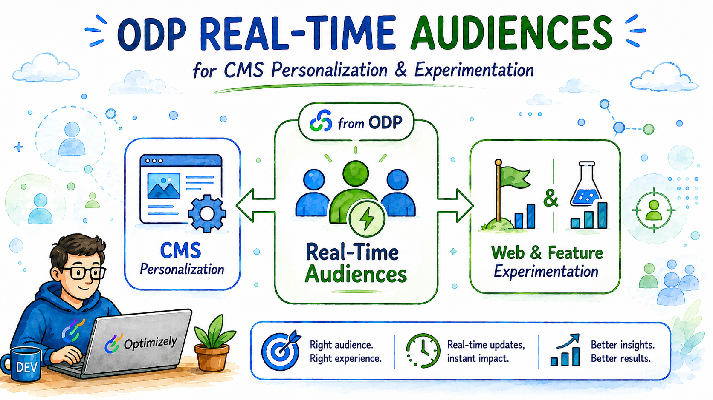
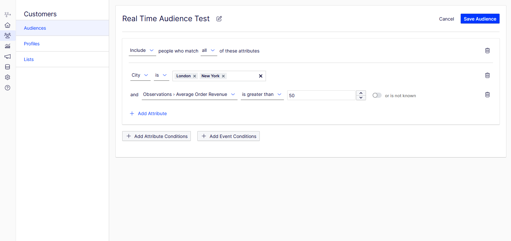
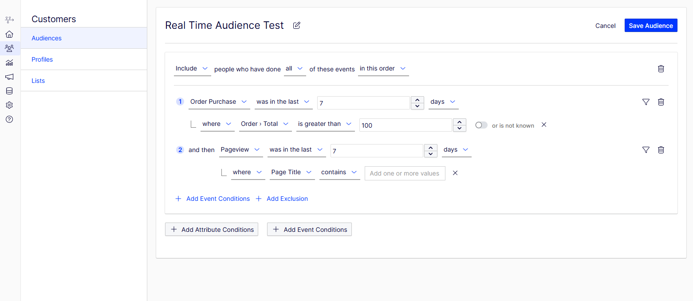
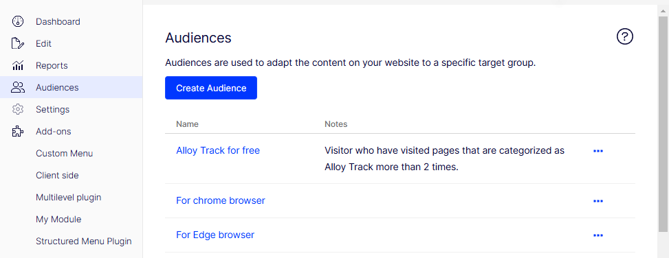
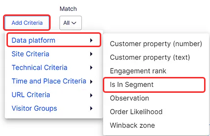
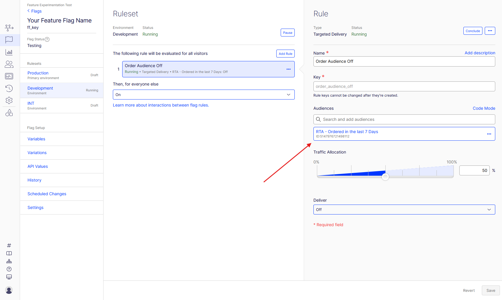
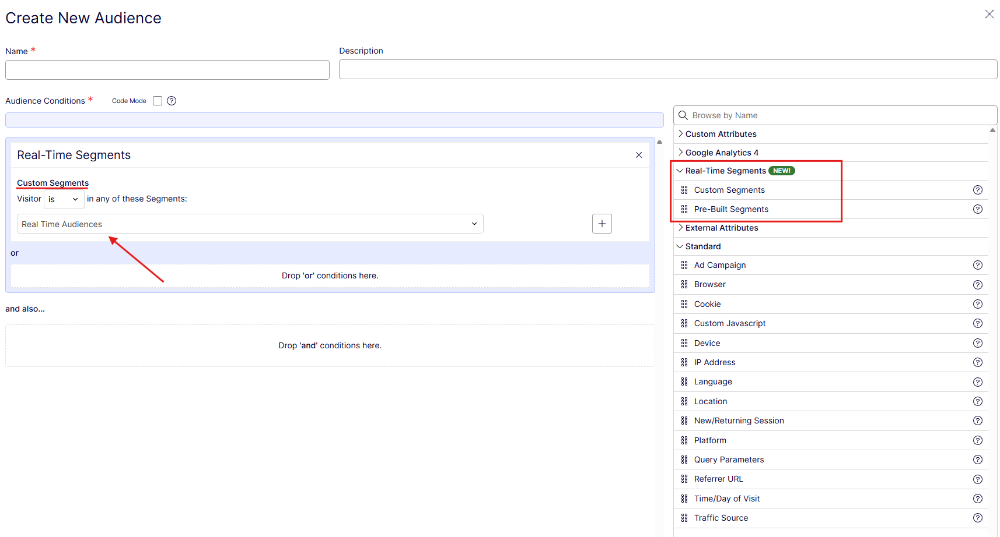

---

title: "Designing ODP Real-Time Audiences for CMS Personalization and Experimentation"
description: "A practical look at when to use ODP Real-Time Audiences, how to build them, and how they fit into CMS personalization and Feature Experimentation."
pubDate: 2026-06-11
publishedAt: 2026-06-11T22:58:07+02:00
tags: ["Optimizely", "ODP", "Real-Time Audiences", "CMS Personalization", "Experimentation"]
draft: false
heroImage: "../../assets/blog-images/07/odp-real-time-audiences.png"
---

## The audience type matters

ODP has more than one way to define a group of customers and the difference is not just naming. If the decision happens while a visitor is on the site, I would usually start with **Real-Time Audiences**.

The simple explanation I use is this: a standard audience is closer to asking ODP to work through your customer base and return a group of matching customers. A real-time audience is closer to asking ODP right now: does this visitor qualify?

That timing difference changes how I design the audience.

## Standard Audiences vs. Real-Time Audiences

Standard audiences are still useful. They are a good fit for ODP reports, data sync activations, one-time campaigns, behavioral campaigns, and cases where you need customer data older than 28 days.

Real-Time Audiences solve a different problem. They are built for fresher profile and behavior checks that can be used by other Optimizely products, including CMS personalization and Feature Experimentation.

| Audience type      | Best fit                                                              | Practical limit                                        |
| ------------------ | --------------------------------------------------------------------- | ------------------------------------------------------ |
| Standard Audience  | Reports, campaigns, data sync, wider historical customer grouping     | Not the first choice for an on-page targeting decision |
| Real-Time Audience | Web personalization, CMS targeting, Feature Experimentation targeting | Event lookback is limited to 28 days                   |

One small naming detail is still visible in the documentation: Optimizely uses **audiences** and **segments** interchangeably in some places. In the UI and in normal project conversations, I would use "audience" now, but do not be surprised if older docs, APIs, or some technical pages still say "segment".

## Building with attribute conditions

Attribute conditions are about who the customer is right now in ODP. This can include profile fields, observations, custom properties, or other customer-rooted data.

Good examples are:

* total customer spend,
* order count,
* loyalty tier,
* known email consent,
* custom properties imported from CRM, commerce, or another system.

The important part is that attribute conditions are not limited to one simple field check. You can combine multiple profile-level signals and narrow the audience with filters that describe the group more precisely.

This is where I usually start, because attributes make the audience easier to reason about. If the business says "high-value customer", I want that definition to be explicit before I add behavior on top.

One practical detail from the Real-Time Audiences definition matters here. Customer conditions are evaluated against the current customer record, and null-like values do not magically become a match. If a custom field is optional, design the condition so missing data does not create a targeting surprise.

## Building with event conditions

Event conditions are about what the customer has done. This is where Real-Time Audiences become much more useful for CMS and Feature Experimentation, because you can react to recent behavior instead of relying only on stored profile attributes.

The ODP builder lets you work with events such as page views, product detail views, cart activity, and order purchases. For event conditions, the lookback window can go up to **28 days**.

What I like about the ODP audience builder is that the conditions read very close to how you would describe them out loud. You can build criteria around recent page views, purchases, onsite activity, counts, filters, exclusions, and event order without translating everything into a technical query first.

The important part is not the exact example on the screen. The point is that Real-Time Audiences can become quite specific. You can combine events, add filters, define time windows, and narrow the group until it matches the audience you actually want to target.

That makes creating the right criteria for Real-Time Audiences fairly straightforward. You still need to understand the business rule, but the UI does a good job of helping you express that rule in a readable way.

For example, this can be something as simple as:

* include visitors who viewed a product detail page at least 3 times in the last 7 days,
* include visitors who added something to cart in the last 24 hours, but exclude those who already purchased.

## CMS personalization integration

Real-Time Audiences can be used in CMS personalization after the ODP integration is configured.

For CMS, this usually means installing and configuring the ODP Visitor Groups package, then creating a CMS audience with a Data Platform criterion that checks whether the visitor belongs to a selected ODP Real-Time Audience.

The naming can be a little confusing here. In newer CMS documentation, Optimizely talks about **Audiences**, formerly called **Visitor Groups**. In older CMS projects and conversations, people may still say Visitor Groups. The idea is the same: you create a targeting rule and use it to decide which version of a block, section, or personalized element should be shown to the visitor.

The useful part is the connection point: CMS personalization can use a Data Platform criterion to check whether the current visitor belongs to an ODP Audience (Segment).

In practice, the flow looks like this:

* create the Real-Time Audience in ODP,
* expose it through the CMS integration,
* select it as a criterion in a CMS audience,
* use that audience for personalized CMS content.

## Feature Experimentation targeting

The same audience design can also support Feature Experimentation. After the ODP integration is enabled, Real-Time Audiences can be used in flag rules for targeted deliveries, A/B tests, and multi-armed bandit optimizations.

In practice, the audience becomes one of the targeting conditions in the flag rule. That means the same Real-Time Audience you prepare in ODP can be used to decide who should receive a specific delivery or experiment variation.

There is one timing caveat I would keep in mind. ODP is fast, but it is not the same as checking a local value in your application code. Optimizely documentation describes Real-Time Audiences as refreshing in less than 90 seconds, with most requests taking under 10 seconds.

That means I would not use a Real-Time Audience to decide what to show immediately after a purchase on the confirmation page. For that case, local state or a custom user attribute is safer.

For onsite personalization based on recent browsing, cart behavior, or previous engagement, Real-Time Audiences are a much better fit.

## Web Experimentation targeting

Real-Time Audiences can also be used in Web Experimentation.

<!-- IMAGE: Web Experimentation audience condition using Real-Time Segments -->

When creating an audience in Web Experimentation, Real-Time Segments can be selected as one of the audience conditions.

I would treat this as another place where ODP can help keep targeting logic closer to customer data. Instead of rebuilding the same rule separately in every tool, you can define the audience in ODP and use it.

## Where Real-Time Audiences fit

For me, Real-Time Audiences are one of the more practical parts of ODP because they connect customer data with the moment when the visitor is actually doing something on the site.

I would still use standard audiences for reporting, campaigns, exports, data sync, and longer historical analysis. That is where they make sense.

But when the audience decides what a visitor should see right now, Real-Time Audiences are usually a better fit. You can use them for CMS personalization through Audiences for personalized blocks and sections, for Web Experiences based on recent behavior and for Feature Experimentation targeting.

That makes them a useful bridge between ODP, CMS, and Experimentation. You define the audience once in ODP, then use it where the visitor experience is actually decided.

Regards,
Wojtek

## Sources

1. [Build real-time audiences in ODP](https://support.optimizely.com/hc/en-us/articles/37582243690765-Build-real-time-audiences-in-ODP)
2. [Create standard audiences](https://support.optimizely.com/hc/en-us/articles/37457190898957-Create-standard-audiences)
3. [Real-Time Segments definition](https://docs.developers.optimizely.com/optimizely-data-platform/docs/realtimesegments-defining-real-time-segments)
4. [Configure Real-Time Audiences to personalize CMS](https://docs.developers.optimizely.com/optimizely-data-platform/docs/odp-cms)
5. [Implement the ODP JavaScript tag](https://docs.developers.optimizely.com/optimizely-data-platform/docs/implement-the-odp-javascript-tag)
6. [Real-Time Audiences for Feature Experimentation](https://docs.developers.optimizely.com/feature-experimentation/docs/real-time-audiences-for-feature-experimentation)
7. [Build Feature Experimentation audiences in ODP](https://support.optimizely.com/hc/en-us/articles/42410249910157-Build-Feature-Experimentation-audiences-in-ODP)
