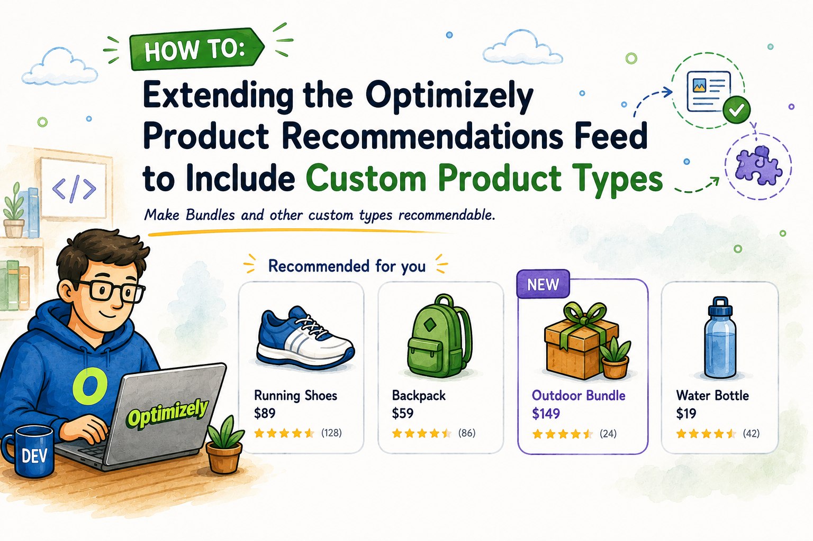

## The feed is more open than it first looks

One thing I really like about Optimizely Product Recommendations is how far you can take the product feed when you need to. The catalog data is produced by two Scheduled Jobs that ship with the Commerce Connect integration package (`EPiServer.Personalization.Commerce`): **Export product feed** and **Export product feed incrementally**. Out of the box they do a solid job for a standard catalog, walking your entries and building a feed the recommendation service can consume.



The interesting part is what happens when your catalog has types that are not plain Variants. With a bit of programming effort, you can make the feed include almost anything you want, as long as the items meet the properties the feed expects. There is no hard limit here, just an extension point waiting to be used.

A good example is the **Bundle**. In Commerce Connect a Bundle is a built-in catalog type (`BundleContent`), but it is really a container: it groups Variants, and the Variants are the sellable units that carry a SKU. Variants are indexed into Product Recommendations by default. Bundles are not, because a Bundle has no SKU or stock of its own.

**That is the whole point of this post.**

With a bit of code you read a Bundle's Variants, compute its price and stock from them, and append the Bundle to the feed as its own recommendable item. The Scheduled Jobs keep doing everything they already do, and Bundles start showing up in recommendations next to the Variants. When the SmartRecs response comes back, you process it on the backend so the Bundle renders correctly and supports add to basket, like any other recommendation.

## Where the extension point is

The feed is built through `ICatalogFeedService` in `EPiServer.Personalization.Commerce.CatalogFeed`. That is the service the export scheduled job uses to produce the `SyndicationFeed` that gets pushed to the recommendation service.

If you look at the interface in the package, it is small, which is exactly why it is such a comfortable place to extend. Here it is, straight from the assembly:

```csharp
// Decompiled with JetBrains decompiler
// Type: EPiServer.Personalization.Commerce.CatalogFeed.ICatalogFeedService
// Assembly: EPiServer.Personalization.Commerce, Version=4.1.31.0, Culture=neutral, PublicKeyToken=8fe83dea738b45b7
// Assembly location: episerver.personalization.commerce\4.1.31\lib\net6.0\EPiServer.Personalization.Commerce.dll

using EPiServer.Core;
using System.Collections.Generic;
using System.ServiceModel.Syndication;

#nullable disable
namespace EPiServer.Personalization.Commerce.CatalogFeed;

public interface ICatalogFeedService
{
  SyndicationFeed GetCatalogFeed(string scope);

  SyndicationFeed GetCatalogFeed(IEnumerable<ContentReference> contentLinks, string scope);
}
```

We don't need to worry about how the default service creates items in the feed. We get a ready-made feed and simply add our own items to it. The only thing that matters is that each item we add meets the feed's properties requirements.

## The pattern: decorate, do not replace

This is the same idea I reached for when [customizing product data with `IEntryAttributeService`](/blog/2026-03-20-customizing-product-data-for-optimizely-product-recommendations): 
- register your own implementation, 
- inject the default implementation
- change only the elements that matter to you.

In this case, the change is even smaller—here’s an example of how it might look in practice.

ProductBundle` stands for your own bundle content type, for instance one inheriting `BundleContent` and `IBundleService` is where the variant based price and stock logic lives:

```csharp
using System.Collections.Generic;
using System.Linq;
using System.ServiceModel.Syndication;
using EPiServer;
using EPiServer.Core;
using EPiServer.Personalization.Commerce.CatalogFeed;
using Mediachase.Commerce.Catalog;

public class BundleCatalogFeedService : ICatalogFeedService
{
    private readonly ICatalogFeedService _inner;
    private readonly IContentLoader _contentLoader;
    private readonly ReferenceConverter _referenceConverter;
    private readonly IBundleService _bundleService;

    public BundleCatalogFeedService(
        ICatalogFeedService inner,
        IContentLoader contentLoader,
        ReferenceConverter referenceConverter,
        IBundleService bundleService)
    {
        _inner = inner;
        _contentLoader = contentLoader;
        _referenceConverter = referenceConverter;
        _bundleService = bundleService;
    }

    public SyndicationFeed GetCatalogFeed(string scope)
        => AppendBundleItems(_inner.GetCatalogFeed(scope), GetLiveBundles());

    public SyndicationFeed GetCatalogFeed(IEnumerable<ContentReference> contentLinks, string scope)
        => AppendBundleItems(_inner.GetCatalogFeed(contentLinks, scope), GetLiveBundles(contentLinks));

    private SyndicationFeed AppendBundleItems(SyndicationFeed feed, IEnumerable<ProductBundle> bundles)
    {
        var items = feed.Items.ToList();

        foreach (var bundle in bundles)
        {
            var item = BuildBundleItem(bundle);
            if (item != null)
            {
                items.Add(item);
            }
        }

        feed.Items = items;
        return feed;
    }
}
```

Two things are worth pointing out.

First, both overloads are handled. If you only override the full-catalog one, the next incremental export after a publish will drop your custom items again. This is easy to miss.

Second, `feed.Items` is read once and then reassigned. `SyndicationFeed.Items` can be lazy, so copying it into a list before you add anything keeps the enumeration predictable.

## Deciding what counts as exportable

The default feed has its own rules for what is recommendable. Your custom type needs the same kind of gate, and it should match how the item behaves on the site.

For a bundle, my rule is usually: it has to be published and actually sellable. Anything else is noise in the recommendation engine.

```csharp
private IEnumerable<ProductBundle> GetLiveBundles()
{
    var references = _contentLoader.GetDescendents(_referenceConverter.GetRootLink());

    return _contentLoader
        .GetItems(references, LanguageSelector.AutoDetect())
        .OfType<ProductBundle>()
        .Where(IsLive);
}

private IEnumerable<ProductBundle> GetLiveBundles(IEnumerable<ContentReference> contentLinks)
{
    if (contentLinks == null)
    {
        yield break;
    }

    foreach (var contentLink in contentLinks)
    {
        if (!ContentReference.IsNullOrEmpty(contentLink) &&
            _contentLoader.TryGet<ProductBundle>(contentLink, out var bundle) &&
            IsLive(bundle))
        {
            yield return bundle;
        }
    }
}

private static bool IsLive(ProductBundle bundle)
    => bundle != null && bundle.PublishOntoSite && bundle.Sellable;
```

## Building the feed item

Now the details. `BuildBundleItem` is where we decide exactly which properties end up on our new indexed item, the one that gets sent to recommendations. Each property is one `ElementExtension` on the `SyndicationItem`. Add a line, add a property:

```csharp
private SyndicationItem BuildBundleItem(ProductBundle bundle, XNamespace ns, IReadOnlyList<string> locations)
{
    var url = _bundleService.GetBundleUrl(bundle);
    if (string.IsNullOrEmpty(url))
    {
        return null;
    }

    // Everything on the item is derived from the Bundle's Variants.
    var bundledVariants = _bundleService.GetBundleVariants(bundle);
    var stockSummary = _bundleService.BuildStockSummary(bundle, bundledVariants);
    var bundlePrice = _bundleService.CalculatePrice(bundle, bundledVariants);

    var item = new SyndicationItem
    {
        Id = bundle.Code,
        PublishDate = bundle.StartPublish ?? DateTime.UtcNow
    };

    var title = string.IsNullOrWhiteSpace(bundle.DisplayName) ? bundle.Name : bundle.DisplayName;
    var imageLink = _bundleService.GetImageUrl(bundle);
    var description = _bundleService.GetDescription(bundle);
    var stock = stockSummary.TotalAvailable.ToString("f0", CultureInfo.InvariantCulture);

    // Localized properties, one set per feed location.
    foreach (var location in locations)
    {
        var loc = new XAttribute("location", location);
        item.ElementExtensions.Add(new XElement(ns + "title", new XAttribute(loc), title));
        item.ElementExtensions.Add(new XElement(ns + "imageLink", new XAttribute(loc), imageLink));
        item.ElementExtensions.Add(new XElement(ns + "link", new XAttribute(loc), url));
        item.ElementExtensions.Add(new XElement(ns + "description", new XAttribute(loc), description));
        item.ElementExtensions.Add(new XElement(ns + "stock", new XAttribute(loc), stock));
    }

    // Non-localized attributes.
    item.ElementExtensions.Add(BuildAttribute(ns, "contenttype", "Bundle"));
    item.ElementExtensions.Add(BuildAttribute(ns, "isBundle", "true"));

    if (bundlePrice.HasPrice)
    {
        item.ElementExtensions.Add(new XElement(ns + "price",
            bundlePrice.Amount.ToString("f2", CultureInfo.InvariantCulture)));
    }

    // Need more data on the item? Add another property here:
    // item.ElementExtensions.Add(BuildAttribute(ns, "bundleSize", bundledVariants.Count.ToString()));

    return item;
}

private static XElement BuildAttribute(XNamespace ns, string name, string value)
    => new XElement(ns + "attribute", new XAttribute("name", name), value ?? string.Empty);
```

## Registration with service interception

The default `ICatalogFeedService` is registered by the Commerce Connect integration package. To wrap it, register your decorator as the final `ICatalogFeedService` and pass the default implementation into its constructor.

In my case, it looks like this:

```csharp
services.Intercept<ICatalogFeedService>((serviceProvider, inner) =>
    new BundleCatalogFeedService(
        inner,
        serviceProvider.GetRequiredService<IContentLoader>(),
        serviceProvider.GetRequiredService<ReferenceConverter>(),
        serviceProvider.GetRequiredService<IBundleService>()));
```

The original implementation is provided as `inner` and wrapped with BundleCatalogFeedService. Scheduled jobs resolve the decorated service, so no changes to the jobs themselves are required.


## What to check before Go-Live?

- Run the `Export product feed` & `Export product feed incrementally` scheduled jobs manually and inspect the generated feed. Your custom items should appear next to the standard products, not replace them.
- Publish a single bundle and confirm the incremental export picks it up through the `contentLinks` overload.
- Add a custom attribute (like `isBundle`) so merchandisers can build a strategy that includes or excludes these items later (by using additional rules in the algorithms of the relevant widgets).
- Watch the full-catalog path on large catalogs. `GetDescendents` from the root can be heavy, so filter early and load only what you need.

## One final thought

Commerce Connect gives us a lot of freedom to extend the platform and introduce custom behaviour almost anywhere. That flexibility is one of its biggest strengths, but it also comes with responsibility.

Once you replace or decorate part of the default pipeline, that implementation becomes your code to test, maintain, and review during upgrades. A change that looks harmless in a new package version may become a breaking change for a custom integration that depends on internal behaviour or service registration details.

That doesn't mean you should avoid these extension points. Quite the opposite. They are often the cleanest way to solve real business requirements. You just need to ensure that the customizations are minor, isolated, thoroughly tested, and easy to verify after each Commerce Connect update.

In this case, the decorator keeps the change focused: the default feed still does the heavy lifting, the scheduled jobs remain untouched, and the custom logic lives in one place.

Regards,
Wojtek

## Sources

1. [Product Recommendations (Optimizely Recommendations)](https://docs.developers.optimizely.com/recommendations/v1.1.0-product-recommendations/docs/personalization)
2. [Recommendations integration for Commerce Connect](https://docs.developers.optimizely.com/commerce-connect/docs/recommendations)
3. [Optimizely Product Recommendations (Support)](https://support.optimizely.com/hc/en-us/articles/4413200703501-Optimizely-Product-Recommendations)
